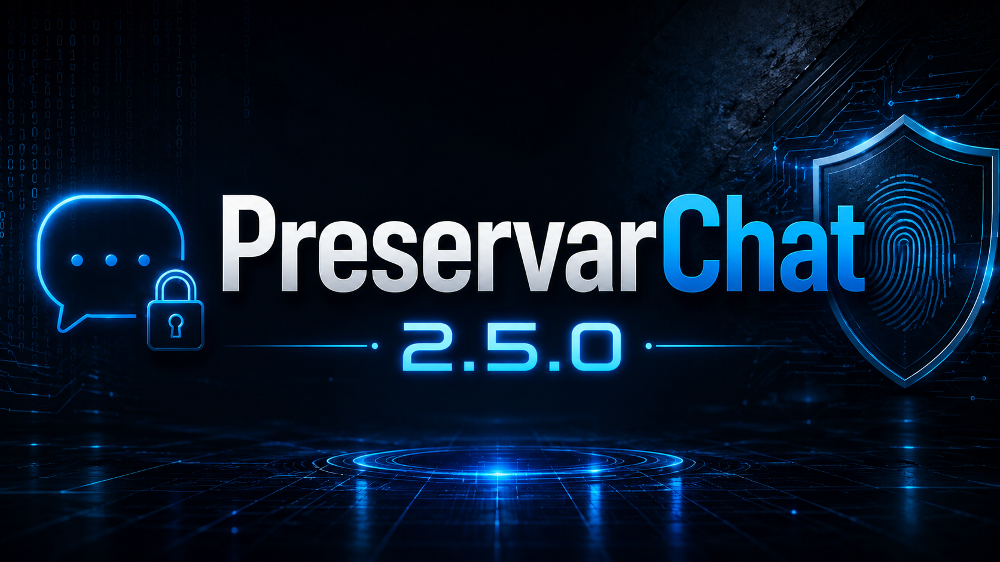

# PreservarChat 2.5 FINAL


## Descargar PreservarChat

[](https://github.com/eelciberseguridad/PreservarChat/releases/download/v2.5.0/PreservarChat_SOLO_x64.exe)

[](https://github.com/eelciberseguridad/PreservarChat/releases/download/v2.5.0/PreservarChat_SOLO_x86.exe)

Trabaja con una conversación exportada de Whatsapp por expediente y mantiene un flujo simple.

## Funciones reales

- Crea expedientes locales.
- Registra datos del caso, dispositivo, cuenta de WhatsApp de origen y conversación.
- Calcula SHA-256 y SHA-512.
- Genera manifiestos y bitácora.
- Verifica posteriormente la integridad de los archivos.
- Permite incorporar imágenes, videos, audios, PDF, Word, Excel, ODT/ODS, RTF y CSV.
- Controla duplicados por huella criptográfica donde corresponde.
- Permite corregir cargas mediante operaciones de eliminación/retiro con confirmación.
- Genera actas PDF.
- Permite abrir, localizar e imprimir actas.
- Genera un ZIP final de entrega y calcula su SHA-256.
- Mantiene el Acta Final fuera del ZIP de evidencia.
- Incluye controles defensivos para archivos ZIP.

## No suplanta una pericia forense

PreservarChat **no realiza adquisición forense del dispositivo**. No extrae bases internas de WhatsApp, no recupera mensajes borrados, no rompe cifrado, no analiza memoria y no determina la identidad o autoría real de los participantes.

La aplicación **no se conecta a WhatsApp, no accede a sus servidores y no usa su API**.

Su función es preservar y documentar material que ya fue exportado, desde el momento en que ese material se incorpora a PreservarChat.

Leé [ALCANCE_Y_LIMITES.md](ALCANCE_Y_LIMITES.md).

## Flujo

1. Crear expediente.
2. Datos del caso.
3. Dispositivo.
4. Cuenta de WhatsApp de origen.
5. Conversación exportada.
6. Material complementario.
7. Verificar.
8. Revisar actas.
9. Generar entrega.

## Documentación

- [Guía de uso](docs/GUIA_DE_USO.md)
- [Compilación Windows](BUILD_WINDOWS.md)
- [Seguridad](SECURITY.md)
- [Alcance y límites](ALCANCE_Y_LIMITES.md)
- [Revisión final](docs/REVISION_FINAL_SEGURIDAD_FUNCIONALIDAD.txt)
- [Créditos](CREDITS.md)

## Ejecutar desde Python

```bat
py -3 PreservarChat.py
```

## EXE portable

Usá:

```text
COMPILAR_PORTABLE_X64.bat
COMPILAR_PORTABLE_X86.bat
```

Cada arquitectura requiere una instalación de Python de la misma arquitectura.

## Privacidad

No subas a GitHub expedientes reales, chats, capturas, documentos de clientes o entregas. Revisá siempre `git status` antes de publicar.

## Licencia

Todavía no se asignó una licencia definitiva. Ver `LICENSE_PENDING.md`.
